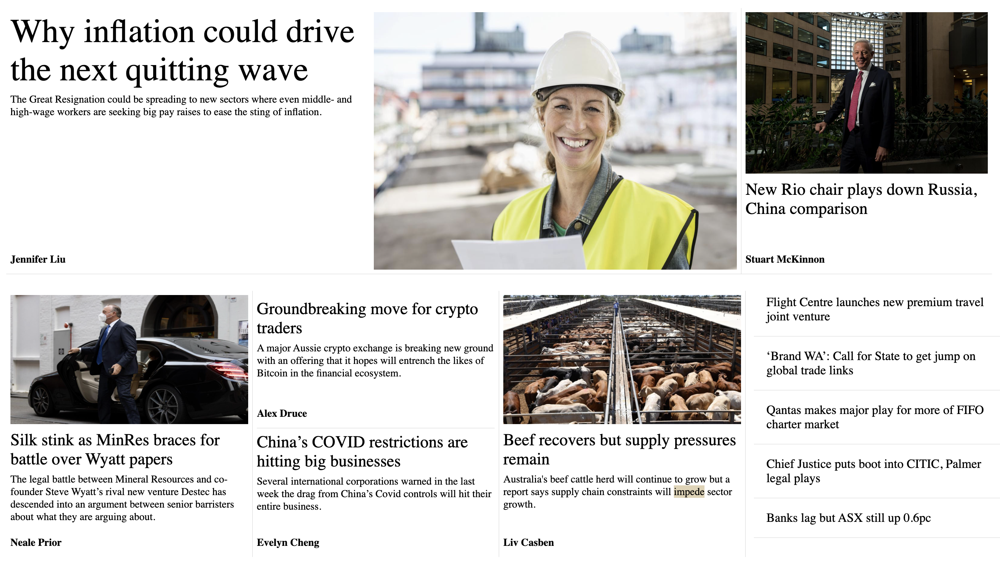
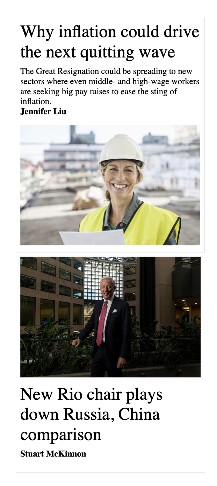
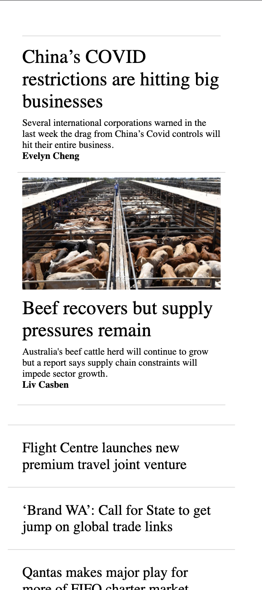
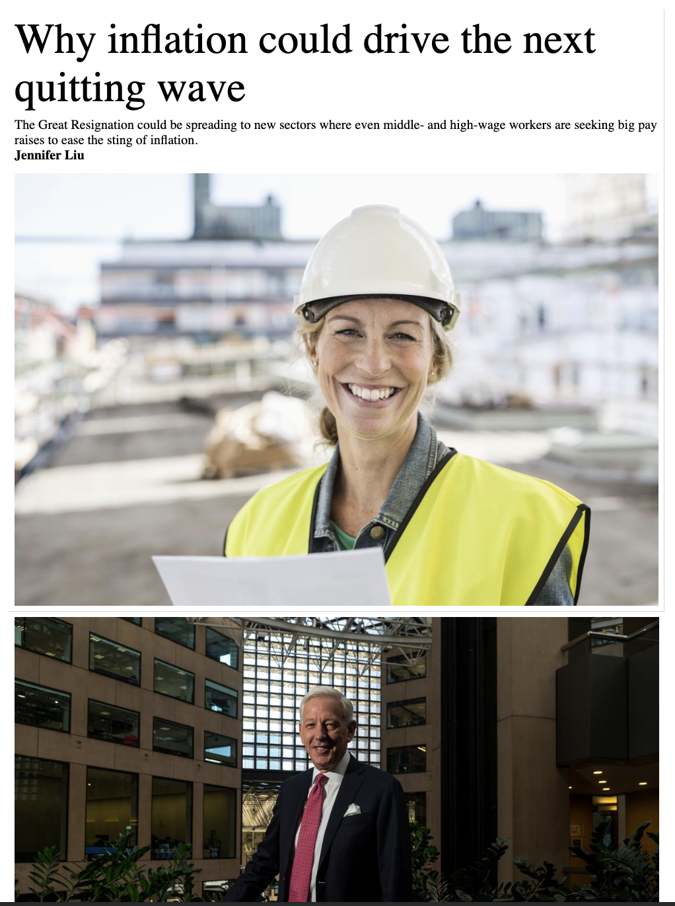
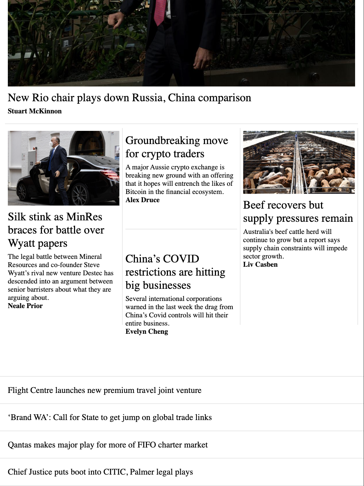

<h1 align="center" id="title">SWM Challenge</h1>

<h2 align="center">By Karla gaudet</h2>

## About

The task was to build a replica of a news page ( a png was provided).

I used Vite as my tool to build this project as it is a tool I am familiar with and have used for several projects.

CSS was used for styling.

Thank you for the opportunity to showcase to you my work!

- Please note: It seems the story about "Oil giant Shell..." was not in the data, so I replaced this story with the extra story property that was provided.

## Screenshots

### Main Desktop View

### Mobile Views

  
  

### Tablet View

  

  

